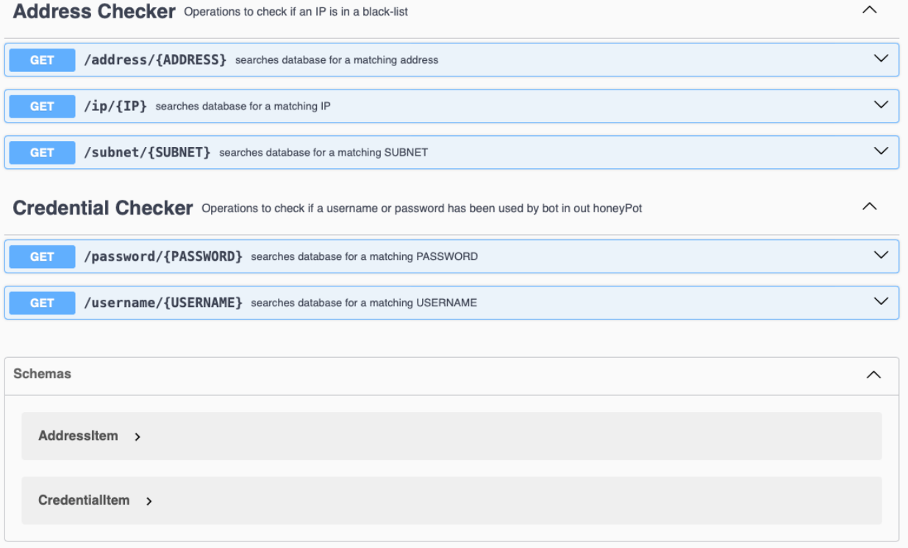

# mmt-cti
This repository implements a set of RESTful APIs that are used to communicate with MMT-CTI platform.

Its [Swagger](https://swagger.io/) description is available [here](./cti-checker/CTI-IPswagger.json).

